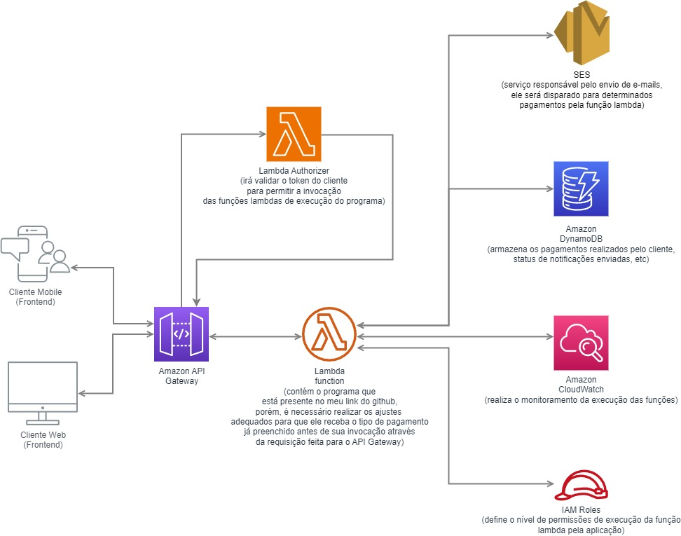

# Desafio BHub

## Visão Geral

Este projeto implementa um sistema de processamento de pagamentos para uma empresa fictícia. O sistema é projetado para lidar com diferentes tipos de produtos e regras de negócio associadas a cada pagamento. O objetivo é criar uma solução flexível que possa acomodar mudanças frequentes nas regras de negócio.

## Estrutura do Projeto

O projeto é composto por quatro componentes principais, sendo eles:

1. **PaymentProcessor:** Este é o componente principal que coordena o processamento de pagamentos. Ele utiliza o padrão Strategy para delegar dinamicamente o processamento para diferentes instâncias de `PaymentRule`.

2. **PaymentRule (Padrão Strategy):** Representa diferentes estratégias de processamento de pagamentos. Cada estratégia é encapsulada em uma classe específica, como `PhysicalProductRule`, `BookRule` e `UpgradeRule`. Essas classes implementam a interface `PaymentRule`, garantindo que todas tenham um método `process_payment()`.

3. **PaymentNotification (Padrão Observer - Observado):** Um componente separado responsável por notificar outros componentes sobre eventos importantes, como o processamento de um pagamento. O `PaymentNotification` atua como um observado, disparando notificações após o processamento de cada pagamento para seus observadores.

4. **EmailNotifier (Padrão Observer - Observador):** Um componente que atua como observador e se inscreve no componente `PaymentNotification` para receber notificações e envia essas notificações para um endereço de e-mail especificado.

## Fluxo de Execução

1. O sistema inicia criando instâncias de `PhysicalProductRule`, `BookRule`, `UpgradeRule`, `PaymentNotification` e `EmailNotifier`.

2. Um pagamento específico é processado pelo `PaymentProcessor`.

3. O `PaymentProcessor` utiliza uma instância da `PaymentRule` apropriada com base no tipo de produto associado ao pagamento (estratégia selecionada dinamicamente).

4. A instância específica de `PaymentRule` processa o pagamento de acordo com a lógica associada a esse tipo de produto.

5. Após o processamento bem sucedido, o `PaymentNotification` é disparado, dependendo do produto.

6. Caso o sistema de notificação seja disparado, o `PaymentNotification` notifica todos os observadores registrados, no nosso caso o `EmailNotifier` (vale ressaltar a facilidade que temos aqui para adicionar novos observadores, como por exemplo, SmsNotifier).

7. O `EmailNotifier` recebe a notificação e envia a mensagem para um endereço de e-mail especificado.

## Padrões de Projeto Utilizados

### 1. Padrão Strategy

O padrão strategy é usado para encapsular algoritmos específicos (regras de negócio) e torná-los intercambiáveis. Diferentes estratégias (por exemplo, `PhysicalProductRule`, `BookRule`, `UpgradeRule`) implementam a mesma interface (`PaymentRule`), permitindo que o `PaymentProcessor` delegue dinamicamente a execução para a estratégia apropriada.

### 2. Padrão Observer

O padrão observer é empregado para fornecer uma maneira flexível de notificar outros componentes sobre eventos importantes no sistema. O `PaymentNotification` age como o sujeito observado, enquanto o `EmailNotifier` age como um observador. Isso desacopla o envio de notificações do processo principal de processamento de pagamentos.

## Executando o Projeto

### Requisitos
- Python 3.x

### Execução do aplicativo (precisa estar na raíz do projeto, pasta desafio-hub)
```bash
python -m app
```

### Execução de testes do aplicativo (precisa estar na raíz do projeto, pasta desafio-hub)
```bash
python -m unittest -v
```

## Possível arquitetura do projeto rodando na AWS


## TODO: Melhoria
Realizei a implementação utilizando o padrão observer apenas para ilustração de solução local, porém uma abordagem mais apropriada para um projeto real seria utilizarmos o componente SNS da AWS para realizarmos o disparo de notificações (eventos) do sistema. A partir daí poderíamos conectar o SES para consumir esse eventos e realizar o envio do e-mail ou consumir em algum outro serviço que tenhamos.